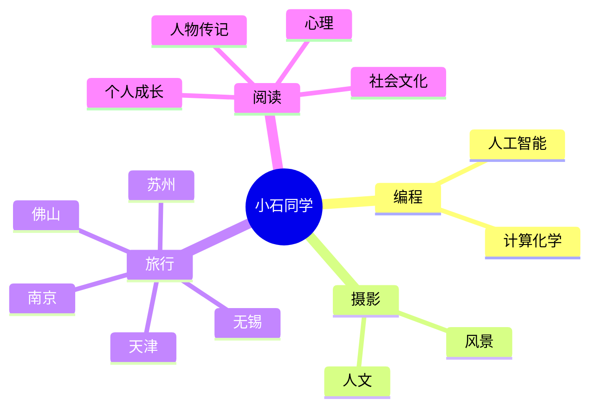

### Hi there 👋

  
  <!-- dynamic typing effect 动态打字效果 -->
  

    
  

  <!-- knock code pictures 敲代码的图片 -->
   
  <!-- Snake Code Contribution Map 贪吃蛇代码贡献图 -->
  

#  🙋 Hello

<table>
<tr><td>

<!-- About me 关于我 -->
### 🤺 About Me
  

&emsp;&emsp;大家好，我是小石同学。

&emsp;&emsp;目前就读于华南理工大学。

&emsp;&emsp;我们正在让这个世界变得更加美好，通过代码的重复使用和延展构建完美体系。

<strong>&emsp;&emsp;We're making the world a better place. Through constructing elegant hierarchies for maximum code reuse and extensibility.</strong>

&emsp;&emsp;长风破浪会有时，直挂云帆济沧海。我开始得太晚了，但总不算太迟。

</td></tr>

<tr>
<td>
  
 
</td></tr>
</table>

<!-- ########################################## 分割 ########################################## -->

<!-- just img 图片 -->

<!--  skill badge 技能徽章 -->
💪 正在学习

  
🧠 计划学习

🧰 常用的工具

<!-- programming tool icon 编程工具图标 -->
 

<!-- svg -->

 

 

<!-- gif -->

<!-- ########################################## 分割 ########################################## -->

<!-- just img 图片 -->

